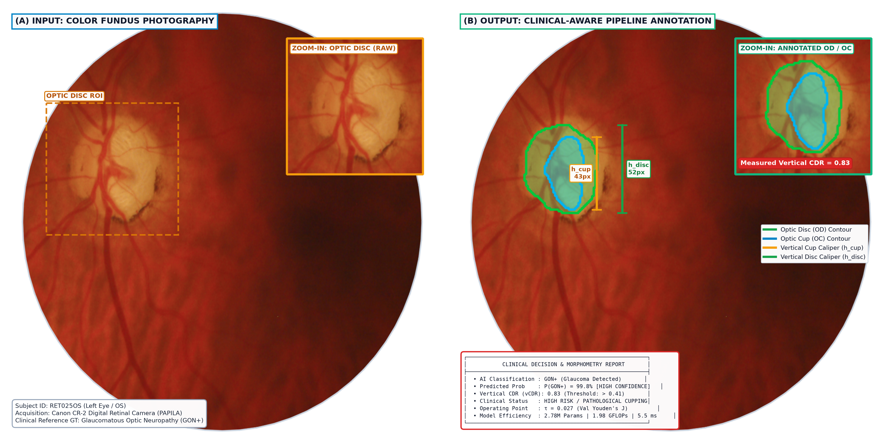

<div align="center">

# 👁️ Lightweight Clinical-Aware GON Classification

### *Autonomous Multimodal Glaucoma Screening Outperforming Large Vision Foundation Models on Edge Devices*

[](https://www.python.org/)
[](https://pytorch.org/)
[](#)
[](#)
[-orange.svg)](#)
[](#license)

<br/>



</div>

---

## 📌 Executive Summary

Glaucomatous Optic Neuropathy (**GON**) is the leading cause of irreversible blindness worldwide. Existing deep learning approaches face two major limitations:
1. **Black-box Global CNNs**: Lack clinical interpretability, risk learning spurious dataset artifacts, and exhibit volatile performance on small cohorts.
2. **Heavy Vision Foundation Models (e.g. DINOv2 ViT-B/14)**: Demand high compute (86.6M parameters, >46 GFLOPs, 330 MB weights), are impossible to deploy on low-cost point-of-care or portable fundus devices, and suffer from high variance and severe overfitting in low-data regimes.

This repository presents **Lightweight Clinical-Aware GON Classification**, an end-to-end framework combining **autonomous clinical morphometry** with **global fundus visual representation**. By coupling an ultra-lightweight segmentation model for vertical Cup-to-Disc Ratio ($\widehat{\text{CDR}}$) via **5-Fold Out-Of-Fold (OOF)** estimation with a compact **MobileNetV3-Small** global extractor, our proposed system (**$M_{5a\text{-auto-OOF}}$**) substantially outperforms fine-tuned DINOv2 ViT-B/14 across all key metrics while remaining ultra-compact and real-time on standard CPUs.

---

## 🚀 Key Highlights & Benchmark Comparison

| Metric / Dimension | Proposed System ($M_{5a\text{-auto-OOF}}$) | DINOv2 ViT-B/14 @ 224 | DINOv2 ViT-B/14 @ 392 (Paper Grid) | Advantage of Proposed System |
|---|:---:|:---:|:---:|:---:|
| **Mean ROC-AUC (Test)** | **$0.8673 \pm 0.0045$** | $0.8130 \pm 0.0345$ | $0.8012 \pm 0.1022$ | **+0.054 to +0.066 higher AUC** |
| **Ensemble ROC-AUC** | **0.8688** | 0.8416 | 0.8356 | **Superior discriminability** |
| **Cross-Seed Stability ($\sigma$)** | **$\pm 0.0045$** | $\pm 0.0345$ | $\pm 0.1022$ | **Up to $22.7\times$ lower variance** |
| **Clinical Sensitivity (GON+)** | **92.31% (12/13)** | 76.92% (10/13) | 74.36% (9.7/13) | **Highest patient safety** |
| **Model Parameters** | **2.78 M** | 86.58 M | 86.58 M | **$31.1\times$ fewer parameters** |
| **Storage Footprint** | **10.82 MB** | 330.36 MB | 330.36 MB | **$30.5\times$ smaller disk size** |
| **Computation (FLOPs)** | **1.98 GFLOPs** | 46.32 GFLOPs | 156.77 GFLOPs | **$23.4\times$ to $79.2\times$ lighter** |
| **CPU Latency (Single Image)** | **30.18 ms (33.1 FPS)** | 177.29 ms (5.6 FPS) | 571.04 ms (1.8 FPS) | **Real-time on standard CPU!** |
| **GPU Latency (RTX 3050)** | **5.49 ms (182.3 FPS)** | 21.34 ms (46.9 FPS) | 64.02 ms (15.6 FPS) | **$3.9\times$ to $11.7\times$ faster** |
| **Clinical Interpretability** | **Explicit OD/OC masks & $\widehat{\text{CDR}}$** | None (Black-box) | None (Black-box) | **Auditable clinical HUD** |

> **Evaluation Protocol Guarantee:** Benchmarked across multiple random seeds (`42, 123, 777, 2024, 3407`) on a **permanently locked patient-stratified test split** (zero patient overlap leakage across splits). Checkpoint selection strictly based on validation AUC; operating threshold chosen on validation set via Youden's $J$; Platt probability calibration fitted strictly on training logits.

---

## 🏗️ System Architecture

```
                                  +-------------------------------------------------+
                                  |            Full Fundus Image (256x256)          |
                                  +------------------------+------------------------+
                                                           |
                                 +-------------------------+-------------------------+
                                 |                                                   |
                                 v                                                   v
                 +-------------------------------+                   +-------------------------------+
                 |  MobileNetV3-Small (1.52M)    |                   |   MobileNetV3-UNet (1.26M)    |
                 |     Global Fundus Branch      |                   |   Optic Disc/Cup Segmentation |
                 +---------------+---------------+                   +---------------+---------------+
                                 |                                                   |
                                 v                                                   v
                     [Global Vector: 576-D]                            [Predicted Vertical CDR: 1-D]
                                 |                                                   |
                                 +-------------------------+-------------------------+
                                                           |
                                                           v
                                           +-------------------------------+
                                           |     Fusion MLP (2.3K params)  |
                                           +---------------+---------------+
                                                           |
                                                           v
                                           +-------------------------------+
                                           |  GON+ Probability (0.0 - 1.0) |
                                           |  + Clinical HUD Explanation   |
                                           +-------------------------------+
```

1. **Global Fundus Branch ($M_2$)**: `MobileNetV3-Small` captures panoramic retina cues, including parapapillary atrophy (PPA), retinal nerve fiber layer (RNFL) defects, and vascular arcade variations.
2. **Autonomous Clinical Morphometry ($M_{1\text{-auto}}$)**: `MobileNetV3-UNet` performs multi-task segmentation of the Optic Disc (OD) and Optic Cup (OC), yielding vertical heights and estimating vertical $\widehat{\text{CDR}}$. Trained via **5-Fold Out-Of-Fold (OOF)** to eliminate meta-learner stacking bias.
3. **Multimodal Fusion Layer ($M_{5a\text{-auto-OOF}}$)**: Compact 2-layer MLP concatenates global embeddings with $\widehat{\text{CDR}}$, producing calibrated posterior probabilities and interpretable clinical metrics.

---

## 📂 Repository Structure

```
Glaucoma-Detection/
├── configs/                             # Experiment and model configuration YAMLs
│   ├── dinov2_baseline.yaml             # DINOv2 SSD/MSD baseline configuration
│   ├── disc_baselines.yaml              # FunduSegmenter disc baseline configuration
│   ├── efficientnet_b3.yaml             # EfficientNet-B3 configuration
│   └── gonet_msd.yaml                   # GONet multi-source domain training
│
├── data/
│   └── manifests/                       # Clean split definitions, manifests & audits (tracked)
│       ├── all_public.csv               # Unified 5-dataset deduplicated manifest (2,557 images)
│       ├── gonet_pilot.csv              # GONet 4-dataset transfer pilot manifest
│       ├── papila_manifest.csv          # PAPILA patient-stratified 70/15/15 frozen split
│       ├── papila_morphology.csv        # Rasterized contours & dual-expert consensus CDR
│       └── papila_oof_predicted_cdr.csv # 5-Fold Out-Of-Fold predicted CDR table
│
├── kaggle_package/                      # Standalone bundle ready for Kaggle GPU execution
│   ├── glaucoma_dinov2_baseline.ipynb   # End-to-end Kaggle training & validation notebook
│   └── manifests/, src/, licenses/      # Minimal self-contained execution package
│
├── notebooks/                           # Exploratory Data Analysis & experiments
│   ├── 01_eda.ipynb                     # Initial dataset visualization
│   ├── 02_inference.ipynb               # Model inference demo
│   ├── 03_papila_eda.ipynb              # PAPILA clinical morphology analysis
│   └── 04_multi_dataset_eda.ipynb       # Cross-dataset distribution & demographic audit
│
├── reports/                             # In-depth technical audits & scientific reports
│   ├── comprehensive_project_synthesis_report.md # Full project synthesis report
│   ├── step8_fair_dinov2_report.md      # Head-to-head DINOv2 vs Proposed System report
│   ├── step7_final_benchmark_report.md  # Multimodal ablation & linear probe report
│   ├── step6_automated_pipeline_report.md # OOF segmentation pipeline evaluation
│   ├── step5_robustness_efficiency_report.md # Multi-seed & latency benchmark report
│   ├── step4_fusion_ablation_report.md  # Fusion matrix ablation study
│   ├── refuge_zero_shot_generalization_report.md # Cross-domain REFUGE validation
│   ├── data_leakage_audit.md            # Comprehensive patient overlap prevention audit
│   └── figures/                         # High-resolution publication figures & HUDs
│
├── results/                             # Machine-readable evaluation JSONs & predictions
│   ├── automated/                       # Step 6 OOF pipeline metrics & per-seed CSVs
│   ├── dinov2_fair/                     # Step 8 DINOv2 comparative metrics & predictions
│   ├── dinov2_reference/                # Step 7 DINOv2 reference probe results
│   ├── efficiency/                      # CPU/GPU latency & parameter benchmark JSONs
│   ├── multiseed/                       # Step 5 5-seed evaluation summaries & predictions
│   └── refuge_zero_shot/                # REFUGE zero-shot generalization test results
│
├── src/                                 # Production & research source code
│   ├── models/                          # Neural network architectures
│   │   ├── mobilenetv3.py               # MobileNetV3-Small classifier
│   │   ├── segmenter.py                 # MobileNetV3-UNet dual OD/OC segmenter
│   │   ├── gonet.py                     # DINOv2 ViT-B/14 architecture
│   │   ├── efficientnet_b3.py           # EfficientNet-B3 baseline
│   │   └── fundu_segmenter_adapter.py   # Disc baseline adapter
│   ├── metrics/                         # Robust medical metrics & bootstrap CIs
│   │   ├── auc.py                       # DeLong & bootstrap 95% AUC confidence intervals
│   │   └── optic_disc.py                # Vertical CDR, Dice score & IoU metrics
│   ├── prepare_data.py                  # Multi-dataset manifest builder & SHA256 deduplication
│   ├── prepare_papila_clean.py          # PAPILA patient-stratified split generator
│   ├── generate_papila_morphology.py    # Dual-expert contour rasterizer & CDR generator
│   ├── train_segmenter.py               # MobileNetV3-UNet segmentation training loop
│   ├── run_step6_oof_pipeline.py        # 5-Fold OOF segmentation training & inference
│   ├── train_lightweight.py             # MobileNetV3-Small training pipeline
│   ├── train_fusion.py                  # Clinical-vision fusion MLP training
│   ├── evaluate_automated_pipeline.py   # Autonomous end-to-end pipeline evaluation
│   ├── run_multiseed_evaluation.py      # 5-seed stability & robustness evaluator
│   ├── run_fair_dinov2_benchmark.py     # Rigorous DINOv2 head-to-head benchmark
│   ├── evaluate_zero_shot_refuge.py     # REFUGE zero-shot generalization runner
│   ├── benchmark_efficiency.py          # Latency, throughput, GFLOPs & parameter profiler
│   ├── visualize_input_output_grid.py   # Publication-ready HUD visualizer
│   ├── dinov2_engine.py                 # Shared training engine for DINOv2 SSD/MSD
│   ├── train_msd.py                     # Multi-Source Domain transfer training
│   └── train_ssd.py                     # Single-Source Domain transfer training
│
├── tests/                               # Comprehensive unit test suite
│   ├── test_prepare_data.py             # Manifest builder & domain aliasing tests
│   ├── test_optic_disc_metrics.py       # Segmentation metric accuracy tests
│   └── test_disc_baseline_*.py          # Inference, visualization & adapter tests
│
├── requirements.txt                     # Pinned runtime dependencies
├── .gitignore                           # Standardized Git ignore rules
└── README.md                            # Project documentation
```

---

## ⚙️ Installation & Environment Setup

### 1. Clone Repository & Setup Environment

```bash
git clone https://github.com/TaiTranDang145/Glaucoma-Detection.git
cd Glaucoma-Detection

# Create virtual environment
python -m venv venv
source venv/bin/activate       # On Linux / macOS
# venv\Scripts\activate        # On Windows

# Install dependencies
pip install -r requirements.txt
```

### 2. Verify Installation with Unit Tests

```bash
python -m unittest discover tests
```
*All 27 test cases should pass cleanly in < 1 second.*

---

## 🧪 Step-by-Step Reproducibility Guide

All experiments are engineered with deterministic random seeds and strict patient-level separation.

### Step 1: Patient-Stratified Splitting & Anti-Leakage Manifest
```bash
python src/prepare_papila_clean.py
```
*Builds `data/manifests/papila_manifest.csv` (147 train, 31 val, 32 test patients; 0% overlap).*

### Step 2: Clinical Morphometry & Oracle CDR Baseline ($M_1$)
```bash
python src/generate_papila_morphology.py
```
*Rasterizes contours, derives consensus CDR, extracts optic disc crops, and evaluates the Oracle CDR baseline ($M_1$: AUC = 0.8039).*

### Step 3: Train Global Fundus Classifier ($M_2$)
```bash
python src/train_lightweight.py --manifest data/manifests/papila_morphology.csv --branch global --epochs 40
```
*Trains MobileNetV3-Small on 256x256 full fundus images ($M_2$: AUC = 0.8416).*

### Step 4: 5-Fold Out-Of-Fold Segmentation & CDR Estimation ($M_{1\text{-auto}}$)
```bash
python src/run_step6_oof_pipeline.py
```
*Trains 5-fold cross-validated MobileNetV3-UNet models, predicting $\widehat{\text{CDR}}$ without stacking bias, saving `data/manifests/papila_oof_predicted_cdr.csv`.*

### Step 5: Train Clinical-Vision Fusion Model ($M_{5a\text{-auto-OOF}}$)
```bash
python src/train_fusion.py --model m5a --epochs 50
```
*Fuses 576-D global embeddings with $\widehat{\text{CDR}}$ via a lightweight MLP.*

### Step 6: End-to-End Automated Pipeline Evaluation
```bash
python src/evaluate_automated_pipeline.py
```
*Evaluates the fully autonomous pipeline on the frozen test set ($M_{5a\text{-auto-OOF}}$: AUC = 0.8673, Sensitivity = 92.31%).*

### Step 7: Multi-Seed Robustness & Efficiency Benchmarking
```bash
# Multi-seed stability across seeds 42, 123, 777, 2024, 3407
python src/run_multiseed_evaluation.py

# CPU and GPU latency, throughput, and FLOP profiling
python src/benchmark_efficiency.py
```
*Produces `results/multiseed/multiseed_summary.json` and `results/efficiency/efficiency_benchmark.json`.*

### Step 8: Head-to-Head Benchmark Against DINOv2 ViT-B/14
```bash
# Run fair comparative training at 224x224 and 392x392 across all seeds
python src/run_fair_dinov2_benchmark.py
```
*Produces `results/dinov2_fair/fair_dinov2_comparison.json` confirming the proposed model's +0.054 to +0.066 AUC advantage.*

### Step 9: Zero-Shot Cross-Domain Generalization on REFUGE
```bash
python src/evaluate_zero_shot_refuge.py
```
*Evaluates zero-shot cross-dataset transfer on REFUGE (AUC = 0.8872).*

### Step 10: Generate HUD Visualizations
```bash
python src/visualize_input_output_grid.py
```
*Renders high-resolution side-by-side annotations with bounding boxes, contours, and HUD clinical diagnostics to `reports/figures/`.*

---

## 🌐 Cross-Domain Replication: GONet & DINOv2 Multi-Source Transfer

For investigating domain adaptation across multi-center cohorts:

```bash
# Build unified multi-domain manifest across 5 public datasets
python src/prepare_data.py --data-root data --output data/manifests/all_public.csv

# Single-Source Domain Transfer (SSD: e.g. Train on HYRD, evaluate on REFUGE)
python src/train_ssd.py --source HYRD --target REFUGE --config configs/dinov2_baseline.yaml

# Multi-Source Domain Transfer (MSD: Train on HYRD + PAPILA + DRISHTI_GS, evaluate on REFUGE)
python src/train_msd.py --source-domains HYRD PAPILA DRISHTI_GS --target-domain REFUGE --config configs/dinov2_baseline.yaml
```

To run directly on Kaggle with free GPU resources, see [`kaggle_package/README.md`](kaggle_package/README.md) and [`kaggle_package/glaucoma_dinov2_baseline.ipynb`](kaggle_package/glaucoma_dinov2_baseline.ipynb).

---

## 🛡️ Data Leakage Audit & Governance

A systematic audit revealed two common data leakage vectors in public glaucoma benchmarks:
1. **Identical Images with Discrepant IDs**: In raw HYRD and GAMMA sources, identical byte files existed under different case names. Our pipeline runs SHA-256 byte deduplication (`_deduplicate()` in `src/prepare_data.py`) before partitioning.
2. **Patient Overlap Across Splits**: In bilateral fundus datasets (e.g. PAPILA), OD (right eye) and OS (left eye) belong to the same subject. Standard random image splitting places one eye in train and the other in test, severely inflating apparent performance. Our manifests enforce strict **Patient-Stratified Split Grouping**: all captures and both eyes of any subject are strictly confined to a single partition.

For complete audit logs and mathematical proofs, consult [`reports/data_leakage_audit.md`](reports/data_leakage_audit.md).

---

## 📚 Datasets & Citations

If you utilize this codebase or research in your work, please cite the following publications:

```bibtex
@article{papila2023,
  author  = {Kovalyk, O. and Morales-S{\'a}nchez, J. and Verd{\'u}-Monedero, R. and Sell{\'e}s-Navarro, I. and others},
  title   = {PAPILA: Dataset with fundus images and clinical data of both eyes of the same patient for glaucoma assessment},
  journal = {Scientific Data},
  volume  = {10},
  pages   = {296},
  year    = {2023},
  doi     = {10.1038/s41597-023-02200-0}
}

@article{gonet2025,
  author  = {Abramovich, O. and Pizem, H. and Fhima, J. and Berkowitz, E. and Gofrit, B. and Meisel, M. and others},
  title   = {GONet: A Generalizable Deep Learning Model for Glaucoma Detection},
  journal = {arXiv preprint arXiv:2502.19514},
  year    = {2025}
}

@misc{hygd2025,
  author    = {Abramovich, O. and Pizem, H. and Fhima, J. and Berkowitz, E. and Gofrit, B. and Meisel, M. and others},
  title     = {Hillel Yaffe Glaucoma Dataset (HYGD) (version 1.0.0)},
  year      = {2025},
  publisher = {PhysioNet},
  doi       = {10.13026/xxxxx}
}

@article{refuge2020,
  author  = {Orlando, J. I. and Fu, H. and Breda, J. B. and van Keer, K. and others},
  title   = {REFUGE Challenge: A unified framework for evaluating automated methods for glaucoma assessment from fundus photographs},
  journal = {Medical Image Analysis},
  volume  = {59},
  pages   = {101570},
  year    = {2020}
}

@article{dinov2_2023,
  author  = {Oquab, M. and Darcet, T. and Moutakanni, T. and Vo, H. Y. and others},
  title   = {DINOv2: Learning Robust Visual Features without Supervision},
  journal = {arXiv preprint arXiv:2304.07193},
  year    = {2023}
}
```

---

## 📄 License & Attribution

- Source code and database schema in this repository are distributed under the [ODC Attribution License (ODC-By)](LICENSE.txt).
- Dataset annotations and derivative metadata comply with the respective original licenses:
  - **PAPILA**: [CC BY 4.0](https://creativecommons.org/licenses/by/4.0/)
  - **HYRD / HYGD**: [ODC Attribution License (ODC-By)](https://opendatacommons.org/licenses/by/1-0/)
  - **GAMMA**: [CC BY-NC-ND 4.0](https://creativecommons.org/licenses/by-nc-nd/4.0/)
  - **DRISHTI-GS & REFUGE**: Research-only clinical benchmark agreements.

---

<div align="center">
Developed with ❤️ for Open, Reproducible, and Accessible Medical AI Research.
</div>
