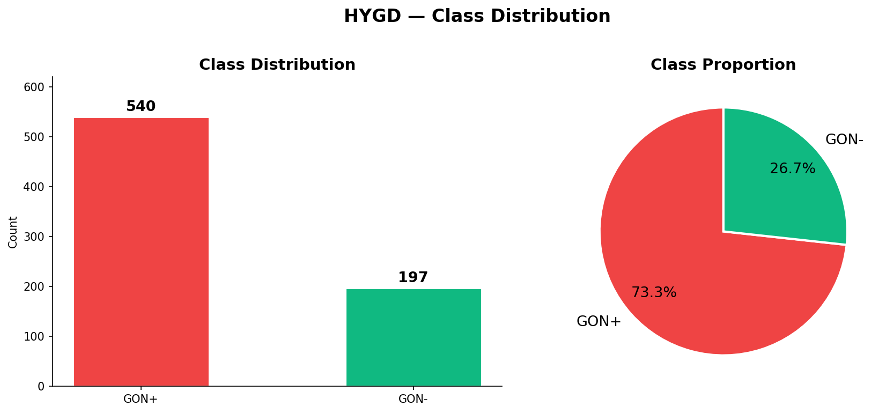
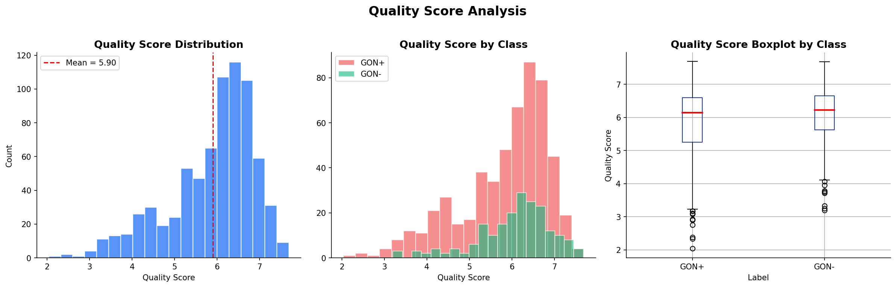
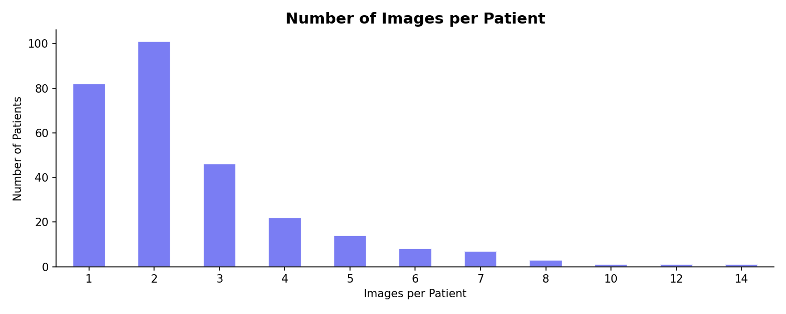
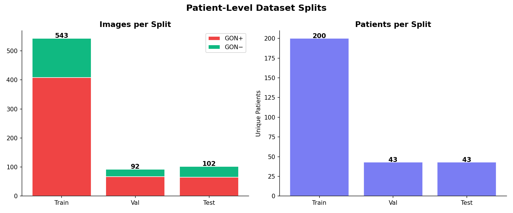

# Báo cáo EDA – Hillel Yaffe Glaucoma Dataset (HYGD)

## Tóm tắt

Bộ dữ liệu gốc có 747 nhãn thuộc 288 bệnh nhân. Bộ dữ liệu làm việc đã được chuẩn bị sẵn tại `data/HYDR/` với **737 ảnh**, **286 bệnh nhân**, gồm 540 ảnh GON+ (73,3%) và 197 ảnh GON− (26,7%). Dự án đọc trực tiếp ảnh và nhãn từ thư mục này.

Phân tích dữ liệu nguồn ghi nhận 10 ảnh trùng chính xác (8 GON+, 2 GON−), trong đó 6 ảnh thuộc các mã bệnh nhân khác nhau. Ở lần chia seed 42 trên dữ liệu gốc, cả 6 cặp này rơi vào các tập khác nhau. Vì vậy bộ dữ liệu đầu vào hiện tại đã được chuẩn bị sau khi xử lý trùng; EDA và huấn luyện chỉ đọc trực tiếp bộ dữ liệu đó.

## 1. Phạm vi và cấu trúc

- Notebook EDA: [notebooks/01_eda.ipynb](../../notebooks/01_eda.ipynb)
- Dataset đã làm sạch sẵn: `data/HYDR/`
  - `Images/`: 737 ảnh
  - `Labels.csv`: 737 dòng nhãn tương ứng
- Cấu hình huấn luyện: [configs/efficientnet_b3.yaml](../../configs/efficientnet_b3.yaml)
- Chia tập và lọc chất lượng: [src/dataset.py](../../src/dataset.py)

CSV có đủ các trường cần dùng (`Image Name`, `Patient`, `Label`, `Quality Score`) và không thiếu giá trị ở các trường này. File vẫn có cột `Unnamed: 4` rỗng hoàn toàn; có thể bỏ cột đó khi xuất lại CSV.

## 2. Phân bố lớp và bệnh nhân

| Nhãn | Số ảnh | Tỷ lệ ảnh | Số bệnh nhân | Ảnh trung bình/bệnh nhân |
|---|---:|---:|---:|---:|
| GON+ | 540 | 73,3% | 185 | 2,92 |
| GON− | 197 | 26,7% | 101 | 1,95 |
| **Tổng** | **737** | **100%** | **286** | **2,58** |

Mất cân bằng theo ảnh là **2,74:1**, còn số bệnh nhân giữa hai lớp chênh lệch ít hơn. GON+ có nhiều ảnh hơn trên mỗi bệnh nhân; vì vậy ảnh không phải các quan sát độc lập tương đương. Mỗi bệnh nhân chỉ có một nhãn trong CSV. Số ảnh/bệnh nhân dao động từ 1 đến 14, trung vị là 2.

## 3. Điểm chất lượng

Điểm chất lượng trong bộ dữ liệu đã làm sạch nằm trong khoảng **2,04–7,69**, trung bình 5,898, trung vị 6,18 và độ lệch chuẩn 1,009.

| Lớp | Trung bình | Trung vị | Độ lệch chuẩn | Nhỏ nhất | Lớn nhất |
|---|---:|---:|---:|---:|---:|
| GON+ | 5,838 | 6,145 | 1,048 | 2,04 | 7,69 |
| GON− | 6,063 | 6,22 | 0,874 | 3,20 | 7,68 |

GON− có điểm trung bình cao hơn khoảng 0,23; độ phân tán lớn và các khoảng điểm chồng lấp. Đây là khác biệt mô tả, không chứng minh chất lượng ảnh gây ra nhãn bệnh.

| Ngưỡng giữ ảnh | Ảnh giữ lại | Tỷ lệ giữ | GON+ giữ lại | GON− giữ lại |
|---|---:|---:|---:|---:|
| ≥ 3 | 731/737 | 99,2% | 534/540 (98,9%) | 197/197 (100%) |
| ≥ 4 | 691/737 | 93,8% | 501/540 (92,8%) | 190/197 (96,4%) |
| ≥ 5 | 608/737 | 82,5% | 431/540 (79,8%) | 177/197 (89,8%) |

Ngưỡng ≥3 trong cấu hình hiện tại loại 6 ảnh GON+, không loại ảnh GON−, và làm mất toàn bộ ảnh của hai bệnh nhân. Nên ghi rõ phân bố nhãn và bệnh nhân sau lọc khi báo cáo kết quả mô hình.

## 4. Toàn vẹn ảnh và trùng lặp

- Đối chiếu `data/HYDR/Labels.csv` với `data/HYDR/Images/`: 737 dòng nhãn khớp 737 file ảnh; không thiếu ảnh hoặc có file thừa.
- Đọc toàn bộ ảnh: không phát hiện file hỏng. Cả 737 ảnh đều vuông, có 69 kích thước phân giải; kích thước phổ biến nhất là 1894 × 1894 px (52 ảnh).
- Nội dung file gồm 726 JPEG và 11 PNG; 11 ảnh PNG mang phần mở rộng `.jpg`. PIL vẫn đọc được, nhưng công cụ chỉ dựa vào phần mở rộng có thể nhận sai định dạng.
- Phân tích dữ liệu gốc ghi nhận 10 ảnh trùng chính xác theo SHA-256: 4 trường hợp cùng mã bệnh nhân và 6 trường hợp khác mã bệnh nhân. Bộ dữ liệu đầu vào ở `data/HYDR/` đã được làm sạch sẵn; pipeline hiện không chạy bước xóa ảnh trùng.

## 5. Chia train/validation/test

Notebook hiển thị split preview trên toàn bộ 737 ảnh đã làm sạch, chưa áp dụng ngưỡng chất lượng:

| Tập | Ảnh | Bệnh nhân | GON+ | GON− | Tỷ lệ GON+ |
|---|---:|---:|---:|---:|---:|
| Train | 543 | 200 | 408 | 135 | 75,1% |
| Validation | 92 | 43 | 67 | 25 | 72,8% |
| Test | 102 | 43 | 65 | 37 | 63,7% |

Pipeline huấn luyện lọc `Quality Score >= 3` trước khi chia. Với seed 42, kết quả là:

| Tập | Ảnh | Bệnh nhân | GON+ | GON− | Tỷ lệ GON+ |
|---|---:|---:|---:|---:|---:|
| Train | 512 | 198 | 376 | 136 | 73,4% |
| Validation | 103 | 43 | 69 | 34 | 67,0% |
| Test | 116 | 43 | 89 | 27 | 76,7% |

Các tập không giao nhau về bệnh nhân. `GroupShuffleSplit` chỉ giữ nhóm bệnh nhân tách biệt, không phân tầng nhãn; tỷ lệ lớp giữa các tập vì thế dao động so với mức 73,3% chung. Nên xem xét stratified group split hoặc đánh giá qua nhiều seed.

## 6. Hình minh họa

## 7. Kết luận

1. Dùng trực tiếp `data/HYDR/Images/` và `data/HYDR/Labels.csv` cho EDA và huấn luyện; bộ dữ liệu đã được làm sạch sẵn.
2. Tiếp tục chia theo bệnh nhân và theo dõi số bệnh nhân cùng phân bố lớp ở từng tập.
3. Ngưỡng chất lượng ≥3 chỉ loại 0,8% ảnh nhưng loại toàn bộ ảnh của hai bệnh nhân; ghi rõ ngưỡng này trong báo cáo kết quả.
4. Bộ dữ liệu không có thông tin lâm sàng bổ sung hoặc xác nhận ngoài nhãn, điểm chất lượng và mã bệnh nhân; EDA này không đánh giá độ chính xác lâm sàng hay khả năng tổng quát hóa.
