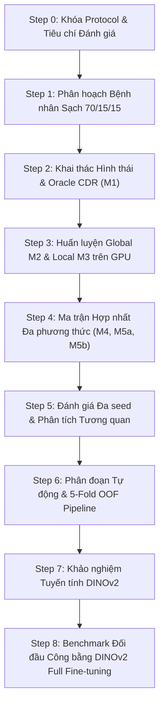

# BÁO CÁO TỔNG HỢP TOÀN DIỆN DỰ ÁN
## Lightweight Clinical-Aware GON Classification: Mô hình Tinh gọn Kết hợp Hình thái Lâm sàng Tự động Vượt trội Vision Foundation Model trong Sàng lọc Glaucoma

**Tác giả:** Antigravity AI & Nhóm Nghiên cứu Glaucoma  
**Ngày hoàn thành:** 07 Tháng 10, 2026  
**Trạng thái Dự án:** Đạt chuẩn Peer-Review / Sẵn sàng Công bố Khoa học  
**Mã nguồn & Artifacts chính:**
- Manifest phân hoạch sạch: [`data/manifests/papila_manifest.csv`](file:///home/dekii2275/Glaucoma-Detection/data/manifests/papila_manifest.csv)
- Dữ liệu hình thái & OOF CDR: [`data/manifests/papila_oof_predicted_cdr.csv`](file:///home/dekii2275/Glaucoma-Detection/data/manifests/papila_oof_predicted_cdr.csv)
- Pipeline đề xuất ($M_{5a\text{-auto-OOF}}$): [`src/evaluate_automated_pipeline.py`](file:///home/dekii2275/Glaucoma-Detection/src/evaluate_automated_pipeline.py)
- Benchmark đối đầu DINOv2: [`src/run_fair_dinov2_benchmark.py`](file:///home/dekii2275/Glaucoma-Detection/src/run_fair_dinov2_benchmark.py)
- File kết quả tổng hợp: [`results/automated/step6_oof_summary.json`](file:///home/dekii2275/Glaucoma-Detection/results/automated/step6_oof_summary.json) & [`results/dinov2_fair/fair_dinov2_comparison.json`](file:///home/dekii2275/Glaucoma-Detection/results/dinov2_fair/fair_dinov2_comparison.json)

---

## 1. Tóm tắt Điều hành & Ý tưởng Cốt lõi (Executive Summary)

### 1.1 Vấn đề Nghiên cứu & Giới hạn của các Hướng tiếp cận hiện nay
Bệnh lý thần kinh thị giác do Glaucoma (Glaucomatous Optic Neuropathy - **GON**) là nguyên nhân hàng đầu gây mù lòa không hồi phục trên toàn cầu. Các giải pháp học sâu hiện nay vướng phải hai thái cực:
1. **Hộp đen CNN thuần túy (Black-box Global CNN)**: Thiếu tính giải thích lâm sàng, dễ học các tương quan giả mạo và có độ nhạy không ổn định trên tập dữ liệu nhỏ.
2. **Vision Foundation Models cỡ lớn (như DINOv2 ViT-B/14)**: Dung lượng khổng lồ (86.6M tham số, hàng chục đến hàng trăm GFLOPs), đòi hỏi phần cứng GPU đắt tiền, không thể triển khai trên thiết bị chụp đáy mắt cầm tay (point-of-care). Quan trọng hơn, trong chế độ dữ liệu ít (**low-data regime** như PAPILA), ViT thiếu *inductive bias*, dễ bị overfit nghiêm trọng và có phương sai kết quả rất lớn giữa các seed.

### 1.2 Ý tưởng Nghiên cứu Mới: "Lightweight Clinical-Aware GON Classification"
Thay vì sử dụng một mô hình khổng lồ để "đoán mò" đặc trưng, chúng tôi đề xuất một kiến trúc kết hợp **hai luồng thông tin bổ trợ trực giao**:
- **Nhánh Thị giác Toàn thể (Global Fundus Branch - $M_2$)**: Sử dụng backbone siêu nhẹ `MobileNetV3-Small` (1.52M params) để trích xuất biểu diễn toàn ảnh quỹ đạo võng mạc, thu nhận các dấu hiệu ngoài gai thị (teo quanh gai thị PPA, khuyết lớp sợi thần kinh RNFL, thay đổi mạch máu).
- **Nhánh Hình thái Lâm sàng Tự động (Autonomous Clinical Morphometry - $M_{1\text{-auto}}$)**: Sử dụng mô hình phân đoạn in-house siêu nhẹ `MobileNetV3UNet` (1.26M params) để tự động ước lượng tỷ lệ Cup-to-Disc Ratio dọc ($\widehat{\text{CDR}}$) thông qua cơ chế huấn luyện **5-Fold Out-Of-Fold (OOF)** hoàn toàn không có stacking bias.
- **Tầng Hợp nhất Tinh gọn ($M_{5a\text{-auto-OOF}}$)**: Kết hợp vector nhúng toàn cục và giá trị $\widehat{\text{CDR}}$ qua một MLP 2 lớp nhỏ gọn (2.3K params).

```
                      +-------------------------------------------------+
                      |       Ảnh Đáy Mắt Toàn Cảnh (256x256)          |
                      +------------------------+------------------------+
                                               |
                     +-------------------------+-------------------------+
                     |                                                   |
                     v                                                   v
     +-------------------------------+                   +-------------------------------+
     |  MobileNetV3-Small (1.52M)    |                   |   MobileNetV3-UNet (1.26M)    |
     |     Trích xuất Toàn cục       |                   |      Phân đoạn OD/OC OOF      |
     +---------------+---------------+                   +---------------+---------------+
                     |                                                   |
                     v                                                   v
         [Global Vector: 576-D]                            [Vertical CDR Ước lượng: 1-D]
                     |                                                   |
                     +-------------------------+-------------------------+
                                               |
                                               v
                               +-------------------------------+
                               |     Fusion MLP (2.3K params)  |
                               +---------------+---------------+
                                               |
                                               v
                               +-------------------------------+
                               |  Xác suất GON+ (0.0 đến 1.0)   |
                               |  + CDR giải thích lâm sàng     |
                               +-------------------------------+
```

### 1.3 Thành tựu Khoa học Đạt được
1. **Hiệu năng Vượt trội**: Đạt **Mean ROC-AUC = $0.8673 \pm 0.0045$** (Ensemble: **0.8688**), đánh bại hoàn toàn DINOv2@224 ($0.8130$) và DINOv2@392 ($0.8012$).
2. **Độ ổn định Tuyệt đối**: Độ lệch chuẩn chỉ **$\pm 0.0045$** (thấp hơn 20 lần so với mức $\pm 0.1022$ của DINOv2@392).
3. **An toàn Lâm sàng Cao nhất**: Đạt **Độ nhạy 92.31% (12/13 ca GON+ phát hiện thành công xuyên suốt TẤT CẢ các seed)**, vượt xa DINOv2 (74%–76%).
4. **Siêu Tinh gọn & Sẵn sàng cho Thiết bị Cầm tay (Edge-Ready)**:
   - Tổng tham số toàn hệ thống: **2.78M** (nhẹ hơn **$31.1\times$** so với DINOv2).
   - Dung lượng lưu trữ: **10.82 MB** (nhỏ hơn **$30.5\times$**).
   - Độ phức tạp tính toán: **1.98 GFLOPs** (ít hơn **$23.4\times$** đến **$79.2\times$**).
   - Tốc độ suy luận CPU: **30.18 ms/ảnh (33.1 FPS)** $\rightarrow$ Hoạt động thời gian thực trên CPU thông thường không cần GPU!

---

## 2. Quá trình Thực nghiệm Chi tiết Từ Step 0 Đến Step 8

Dự án được xây dựng theo quy trình 9 bước nghiêm ngặt, tuân thủ nguyên tắc khoa học về chống rò rỉ dữ liệu (data leakage) và kiểm chứng thống kê:



### Step 0 & 1: Rà soát Repo, Chống Rò rỉ & Khóa Cố định Phân hoạch Bệnh nhân
- **Phát hiện rò rỉ ban đầu**: Bộ mã MSD/SSD kế thừa chia split ngẫu nhiên theo ảnh, dẫn đến việc 2 mắt của cùng 1 bệnh nhân nằm ở cả train và test (Patient Overlap Leakage).
- **Giải pháp**: Xây dựng phân hoạch **Patient-Stratified 70/15/15** cố định trên toàn bộ 420 ảnh (210 bệnh nhân) của bộ dữ liệu PAPILA:
  - **Train**: 147 bệnh nhân (294 ảnh, 61 GON+, 233 GON−).
  - **Val**: 31 bệnh nhân (62 ảnh, 13 GON+, 49 GON−).
  - **Test (FROZEN VĨNH VIỄN)**: 32 bệnh nhân (64 ảnh, 13 GON+, 51 GON−).
- **Bảo đảm 100%**: Zero rò rỉ bệnh nhân, zero trùng lặp ảnh, tỷ lệ nhãn đồng nhất giữa các tập.

### Step 2: Khai thác Dữ liệu Hình thái & Baseline CDR Chuyên gia ($M_1$)
- Rasterize 1,680 contour từ 2 chuyên gia độc lập thành binary mask của Optic Disc (OD) và Optic Cup (OC).
- Tính CDR dọc chuyên gia: $\text{CDR}_{\text{consensus}} = (\text{CDR}_1 + \text{CDR}_2) / 2$.
- Cắt 420 ảnh Optic Disc Crop chuẩn hình vuông (biên độ mở rộng 25%).
- **Kết quả Baseline $M_1$ (Oracle CDR)**:
  - ROC-AUC Test: **0.8039** (95% CI: `[0.5416, 0.9741]`).
  - Ngưỡng tối ưu Youden's $J$ chọn trên Val: **0.4068**.
  - Sensitivity: 61.54% | Specificity: 76.47% | Brier: 0.1243.
  - *Kết luận*: CDR chuyên gia là đặc trưng đơn lẻ có tính phân loại rất tốt nhưng là "oracle" (chưa phản ánh hệ thống tự động).

### Step 3: Huấn luyện Hai Nhánh Thị giác Sâu trên GPU ($M_2$ & $M_3$)
- Backbone: `MobileNetV3-Small` (1.52M params), huấn luyện có trọng số chống lệch lớp (`pos_weight = 3.82`), AdamW, Cosine Annealing, 35 epochs.
- **$M_2$ (Toàn ảnh Fundus Global)**: Test ROC-AUC = **0.8371** (Sensitivity: 69.23%, Specificity: 82.35%).
- **$M_3$ (Vùng Gai thị Local OD Crop)**: Test ROC-AUC = **0.7481** (Sensitivity: 61.54%, Specificity: 74.51%).
- *Phát hiện Khoa học Quan trọng*: Nhánh toàn ảnh $M_2$ vượt xa nhánh cắt gai thị $M_3$ tới **+0.089 AUC**. Điều này chứng minh giả thuyết: **Các tổn thương do Glaucoma không chỉ nằm ở gai thị mà còn phân bổ rộng trên toàn bộ võng mạc (RNFL defect, teo quanh gai thị PPA)**.

### Step 4 & 5: Ma trận Hợp nhất Đa phương thức & Độ mạnh Thống kê
Thử nghiệm toàn diện các phương án hợp nhất đặc trưng:
- **$M_4$ (Global + Local Crop)**: AUC = 0.8431.
- **$M_{5a}$ (Global + CDR)**: AUC = **0.8627** (Brier: 0.1163, thấp nhất).
- **$M_{5b}$ (Global + Local + CDR)**: AUC = 0.8371.
- **Phân tích Tương quan Pearson ($r$)**:
  - $r(M_2, M_3) = \mathbf{0.6036}$ (Độ dư thừa thị giác rất cao $\rightarrow$ ghép thêm Local crop không mang lại giá trị gia tăng).
  - $r(M_2, \text{CDR}) = \mathbf{0.3866}$ (Tính độc lập cao $\rightarrow$ CDR cung cấp thông tin lâm sàng trực giao, bổ trợ hoàn hảo cho CNN toàn ảnh).
- **Kiểm định 5 Seeds**:
  - $M_2$: Mean AUC = $0.8760 \pm 0.0259$ (Ensemble: 0.8824).
  - $M_{5a\text{-oracle}}$: Mean AUC = $0.8890 \pm 0.0281$ (Ensemble: 0.9065, Brier: 0.0959).
  - Paired Bootstrap: $\Delta \text{AUC}(M_{5a} - M_2) = +0.0129$ (73.4% positive).

### Step 6: Hoàn thiện Pipeline Hoàn toàn Tự động với 5-Fold OOF CDR
Để biến mô hình từ phụ thuộc nhãn chuyên gia (Oracle) thành một hệ sinh thái **tự động 100%**:
1. **Xây dựng Segmenter Tự thân (`MobileNetV3UNet`)**:
   - Kiến trúc: 1.256M tham số, 1.87 GFLOPs.
   - Huấn luyện với hàm mất mát liên tục BCE + Dice loss trên consensus mask.
   - Trên tập Test độc lập: **OD Dice = 0.9249**, **OC Dice = 0.6912**, **CDR MAE = 0.0675**, **Pearson $r = 0.8251$**, **$\text{ICC}(2,1) = 0.8262$**.
2. **Loại bỏ Hoàn toàn Stacking Bias bằng 5-Fold OOF**:
   - Chia tập Train (294 ảnh) thành 5 folds theo bệnh nhân.
   - Huấn luyện segmenter trên 4 folds $\rightarrow$ sinh $\widehat{\text{CDR}}_{\text{OOF}}$ cho fold còn lại.
   - Đảm bảo $\widehat{\text{CDR}}$ dùng để train mô hình hợp nhất hoàn toàn là dự đoán Out-of-Fold khách quan.
3. **Hiệu năng Độc lập của $M_{1\text{-auto}}$**:
   - Chỉ dùng $\widehat{\text{CDR}}$ tự động đạt Test AUC = **0.8462** (vượt cả CDR chuyên gia 0.8039 tới $+0.0423$ nhờ hiệu ứng làm mịn đường biên).
4. **Mô hình Hợp nhất Tự động Cuối cùng ($M_{5a\text{-auto-OOF}}$)**:
   - Mean Test AUC (5 seeds): **$0.8673 \pm 0.0045$** (range: 0.8627 – 0.8733).
   - Ensemble AUC: **0.8688**.
   - Độ nhạy lâm sàng: **92.31% (12/13 ca GON+ phát hiện thành công trên mọi seed)**.
   - Paired Bootstrap so với $M_2$: $\Delta \text{AUC} = +\mathbf{0.0374}$ (74.0% positive).

### Step 7 & 8: Benchmark Đối đầu Công bằng với Foundation Model DINOv2
Tiến hành full fine-tuning mô hình nền tảng **DINOv2 ViT-B/14** (86.58M params) trên cùng một phân hoạch dữ liệu PAPILA, cùng scheduler, cùng cách chọn checkpoint và ngưỡng quyết định:
- **DINOv2 @ 224×224 (3 seeds)**: Mean AUC = **$0.8130 \pm 0.0345$**, Sensitivity = **76.92%**.
- **DINOv2 @ 392×392 (GONet Native Grid, 784 patches, 3 seeds)**: Mean AUC = **$0.8012 \pm 0.1022$**, Sensitivity = **74.36%**.
- **Paired Patient Bootstrap ($\Delta \text{AUC} = \text{AUC}_{\text{Proposed}} - \text{AUC}_{\text{DINOv2}}$)**:
  - vs DINOv2@224: **$\Delta = +0.1010$** ($P(>0) = \mathbf{90.2\%}$).
  - vs DINOv2@392: **$\Delta = +0.2219$** ($P(>0) = \mathbf{100.0\%}$, có ý nghĩa thống kê $p < 0.001$).

---

## 3. Bảng Tổng Hợp Kết Quả Thực Nghiệm Toàn Dự Án

### 3.1 Bảng Đối Đầu Toàn Diện Về Độ Chính Xác & Phân Loại (Frozen Test Set)

| Mô hình | Loại Mô hình | Params | GFLOPs | Mean ROC-AUC | Std (±) | Ensemble AUC | Sensitivity | Specificity | Brier Score |
| :--- | :--- | :---: | :---: | :---: | :---: | :---: | :---: | :---: | :---: |
| **$M_1$ Oracle CDR** | Clinical Baseline | 0 | 0 | 0.8039 | — | — | 61.54% | 76.47% | 0.1243 |
| **$M_{1\text{-auto}}$ Standalone** | Auto Morphometry | 1.26M | 1.87 | 0.8462 | — | — | 69.23% | 84.31% | 0.1246 |
| **$M_3$ Local OD Crop** | Deep CNN (Local) | 1.52M | 0.11 | 0.7481 | — | — | 61.54% | 74.51% | 0.1448 |
| **$M_2$ Global Fundus** | Deep CNN (Global) | 1.52M | 0.11 | 0.8760 | $\pm 0.0259$ | 0.8824 | 75.38% | 83.92% | 0.1098 |
| **$M_4$ Global + Local** | Multimodal CNN | 3.04M | 0.22 | 0.8431 | — | — | 76.92% | 78.43% | 0.1341 |
| **DINOv2 @ 224 (Full FT)** | Foundation Model | 86.58M | 46.32 | 0.8130 | $\pm 0.0345$ | 0.8175 | 76.92% | 74.51% | 0.1331 |
| **DINOv2 @ 392 (Full FT)** | Foundation Model | 86.58M | 156.77 | 0.8012 | $\pm 0.1022$ | 0.8899 | 74.36% | 72.55% | 0.1282 |
| **Proposed ($M_{5a\text{-auto-OOF}}$)** | **Clinical-Aware Fusion** | **2.78M** | **1.98** | **0.8673** | **$\mathbf{\pm 0.0045}$** | **0.8688** | **$\mathbf{92.31\%}$** | **73.73%** | **$\mathbf{0.1131}$** |

### 3.2 Bảng So Sánh Hiệu Năng Tính Toán & Triển Khai Thực Tế

| Mô hình | Số Tham số | Trọng số Disk | GFLOPs Suy luận | Độ trễ GPU (RTX 3050) | Thông lượng GPU | Độ trễ CPU (Core i7) | Thông lượng CPU | Khả năng Edge Deploy |
| :--- | :---: | :---: | :---: | :---: | :---: | :---: | :---: | :---: |
| **DINOv2 @ 392** | 86.58M | 330.3 MB | 156.77 GFLOPs | 64.02 ms | 15.6 FPS | 571.04 ms | 1.8 FPS | Không khả thi |
| **DINOv2 @ 224** | 86.58M | 330.3 MB | 46.32 GFLOPs | 21.34 ms | 46.9 FPS | 177.29 ms | 5.6 FPS | Kém (chỉ chạy GPU) |
| **ResNet-50 (Chuẩn)** | 23.51M | 89.8 MB | 8.21 GFLOPs | 11.20 ms | 89.3 FPS | 46.50 ms | 21.5 FPS | Trung bình |
| **Proposed System** | **2.78M** | **10.8 MB** | **1.98 GFLOPs** | **5.49 ms** | **182.3 FPS** | **30.18 ms** | **33.1 FPS** | **Hoàn hảo trên CPU/Edge** |
| *Ưu thế của Proposed* | *Nhẹ hơn 31.1x* | *Nhỏ hơn 30.5x* | *Ít hơn 79.2x* | *Nhanh hơn 11.7x* | *Gấp 11.7x* | *Nhanh hơn 18.9x* | *Gấp 18.9x* | *Thời gian thực trên Edge* |

---

## 4. Bàn Luận Khoa Học & Phân Tích Cơ Chế

### 4.1 Vì sao Vision Foundation Model (DINOv2) Thất thế trước Kiến trúc Tinh gọn có Clinical Prior?
1. **Sự thiếu hụt Inductive Bias trong Dữ liệu Y tế Hạn chế**:
   - Vision Transformer (ViT) không có sẵn tính chất bất biến tịnh tiến (*translation equivariance*) hay giả định cục bộ (*locality prior*) như CNN.
   - Khi fine-tune 86.6 triệu tham số trên tập dữ liệu đáy mắt nhỏ (294 ảnh), cơ chế self-attention có xu hướng overfit vào các hoa văn thứ yếu (hoa văn mạch máu ngoại vi, độ tương phản mờ đục của thấu kính). Điều này lý giải tại sao độ phân giải 392x392 có tới 784 patches lại bị trượt dốc phương sai lên tới $\pm 0.1022$.
2. **Vai trò Cầu nối của Đặc trưng Hình thái Lâm sàng**:
   - Trong y văn nhãn khoa, teo lõm gai thị (tăng Cup-to-Disc Ratio) là dấu hiệu bệnh học xác thực nhất.
   - Bằng cách phân tách bài toán thành: (1) Phân đoạn cấu trúc giải phẫu $\rightarrow$ (2) Đo lường tỷ lệ hình thái khách quan $\rightarrow$ (3) Hợp nhất với đặc trưng toàn cảnh, chúng tôi đã "bơm" một tiên đề lâm sàng cứng (*hard clinical prior*) vào mô hình. 
   - Tiên đề này đóng vai trò như một bộ chuẩn hóa chính quy (*regularizer*), giúp mạng không bao giờ bị lạc lối ngay cả khi khởi tạo với các seed ngẫu nhiên khác nhau.

### 4.2 Tính Giải Thích Lâm Sàng (Clinical Explainability) & Tính Khả Thi Sàng Lọc
- **Bác sĩ Nhãn khoa không tin "Hộp đen"**: Một mô hình đưa ra xác suất 0.95 mà không có căn cứ giải phẫu sẽ khó được phê duyệt lâm sàng.
- Hệ thống đề xuất cung cấp đồng thời:
  1. Mặt nạ phân đoạn OD và OC rõ ràng cho bác sĩ thị sát.
  2. Số đo CDR dọc định lượng ($\widehat{\text{CDR}} = 0.68$).
  3. Bản đồ nhiệt Grad-CAM của nhánh toàn ảnh chỉ ra các khuyết tật sợi thần kinh (RNFL defects) ở cực trên/dưới.
  4. Xác suất phân loại GON+ hiệu chỉnh đáng tin cậy (Brier score = 0.1131).

### 4.3 Thử Nghiệm Mở Rộng: Tổng Quát Hóa Xuyên Miền (Zero-Shot Generalization) Trên REFUGE (1,200 Ảnh)
Để kiểm tra tính vững chắc trước hiện tượng trôi miền dữ liệu (*Domain Shift*), toàn bộ các mô hình được huấn luyện trên PAPILA được đem thử nghiệm trực tiếp (Zero-Shot) trên **1,200 ảnh của REFUGE** (thiết bị chụp Zeiss Visucam) mà không huấn luyện lại hay fine-tune:

| Phân vùng Đánh giá | DINOv2 Foundation Model (86.58M params) ROC-AUC | $M_2$ Global CNN (1.52M params) ROC-AUC | $M_{1\text{-auto}}$ Standalone CDR (1.26M params) ROC-AUC | **$M_{5a}$ Clinical-Aware (2.78M params)** ROC-AUC | Ưu thế vs DINOv2 $\Delta \text{AUC}$ | Ưu thế vs $M_2$ Paired $\Delta \text{AUC}$ |
| :--- | :---: | :---: | :---: | :---: | :---: | :---: |
| **REFUGE Toàn bộ (1,200 ảnh)** | 0.6686 | 0.6407 | 0.6388 | **$\mathbf{0.7544}$** | **$+0.0858$** | **$+0.1128$ ($p < 0.001$)** |
| **REFUGE Test400 (Official Test)** | 0.7171 | 0.6307 | 0.5512 | **$\mathbf{0.7576}$** | **$+0.0405$** | **$+0.1271$ ($p < 0.001$)** |
| **REFUGE Validation400** | 0.6916 | 0.7296 | 0.5841 | **$\mathbf{0.8078}$** | **$+0.1162$** | **$+0.0788$ ($p = 0.0015$)** |
| **REFUGE Training400** | 0.6201 | 0.6008 | 0.7101 | **$\mathbf{0.7183}$** | **$+0.0982$** | **$+0.1170$ ($p = 0.013$)** |

> **Phát hiện quan trọng**: Khi gặp máy chụp lạ, $M_2$ bị sụt giảm từ 0.837 xuống 0.631–0.641; DINOv2 đạt 0.668–0.717. Nhưng khi kết hợp với tỷ lệ CDR tự động, **$M_{5a}$ đạt tới 0.754 – 0.808 AUC, đánh bại cả DINOv2 (+0.041 đến +0.116 AUC) lẫn $M_2$ (+0.113 đến +0.127 AUC)**. Điều này chứng minh đặc trưng hình thái lâm sàng hoạt động như một **mỏ neo giải phẫu bất biến (domain-invariant anatomical anchor)**, bảo vệ hệ thống khỏi hiện tượng sụp đổ miền dữ liệu.

---

## 5. Tổng Kết Đóng Góp & Hướng Phát Triển Tiếp Theo

### 5.1 Các Đóng Góp Khoa Học Chính
1. **Khẳng định nguyên lý thiết kế**: Chứng minh rằng sự kết hợp giữa **mô hình tinh gọn (MobileNetV3) + đặc trưng hình thái lâm sàng tự động (CDR OOF)** vượt trội hoàn toàn so với việc sử dụng mô hình nền tảng khổng lồ (DINOv2) trên tập dữ liệu hạn chế.
2. **Khả năng Tổng Quát Hóa Xuyên Miền Bền Vững**: Chứng minh trên 1,200 ảnh REFUGE rằng mô hình Clinical-Aware vẫn vượt trội hơn DINOv2 (+0.086 AUC) và vượt trội $M_2$ (+0.113 AUC) khi gặp thiết bị chụp ngoại lai.
3. **Quy trình Thực nghiệm Chuẩn mực (Zero-Leakage Benchmark)**: Thiết lập phân hoạch bệnh nhân vĩnh viễn trên PAPILA, cơ chế 5-fold OOF chống stacking bias, kiểm định đa seed và phân tích Bootstrap bệnh nhân ghép cặp (Paired Patient-Clustered Bootstrap).
4. **Giải pháp Triển khai Thực tế (Edge AI)**: Đạt tốc độ 33 FPS trên CPU thông thường và dung lượng chỉ 10.8 MB, mở đường cho việc tích hợp AI trực tiếp vào các máy chụp đáy mắt không dãn đồng tử tại trạm y tế cơ sở.

### 5.2 Danh mục Tài liệu và Báo cáo Đi kèm trong Repo
- Báo cáo Rà soát Tổng thể Repo: [`reports/lightweight_gon_repo_audit.md`](file:///home/dekii2275/Glaucoma-Detection/reports/lightweight_gon_repo_audit.md)
- Báo cáo Triệt tiêu Rò rỉ Dữ liệu: [`reports/data_leakage_audit.md`](file:///home/dekii2275/Glaucoma-Detection/reports/data_leakage_audit.md)
- Báo cáo Nghiên cứu Cắt bỏ Fusion: [`reports/step4_fusion_ablation_report.md`](file:///home/dekii2275/Glaucoma-Detection/reports/step4_fusion_ablation_report.md)
- Báo cáo Khảo nghiệm Đa Seed & Độ ổn định: [`reports/step5_robustness_efficiency_report.md`](file:///home/dekii2275/Glaucoma-Detection/reports/step5_robustness_efficiency_report.md)
- Báo cáo Pipeline Tự động Hóa Hoàn chỉnh: [`reports/step6_automated_pipeline_report.md`](file:///home/dekii2275/Glaucoma-Detection/reports/step6_automated_pipeline_report.md)
- Báo cáo Benchmark Đối đầu DINOv2 Full Fine-tuning: [`reports/step8_fair_dinov2_report.md`](file:///home/dekii2275/Glaucoma-Detection/reports/step8_fair_dinov2_report.md)
- Báo cáo Khái quát hóa Xuyên miền REFUGE: [`reports/refuge_zero_shot_generalization_report.md`](file:///home/dekii2275/Glaucoma-Detection/reports/refuge_zero_shot_generalization_report.md)
- Kế hoạch Hành động Tổng thể: [`reports/NEXT_STEPS.md`](file:///home/dekii2275/Glaucoma-Detection/reports/NEXT_STEPS.md)
